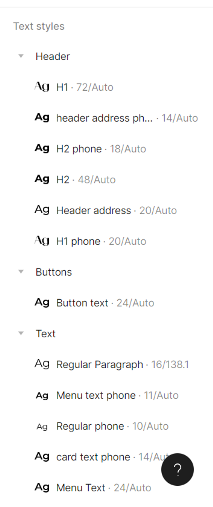
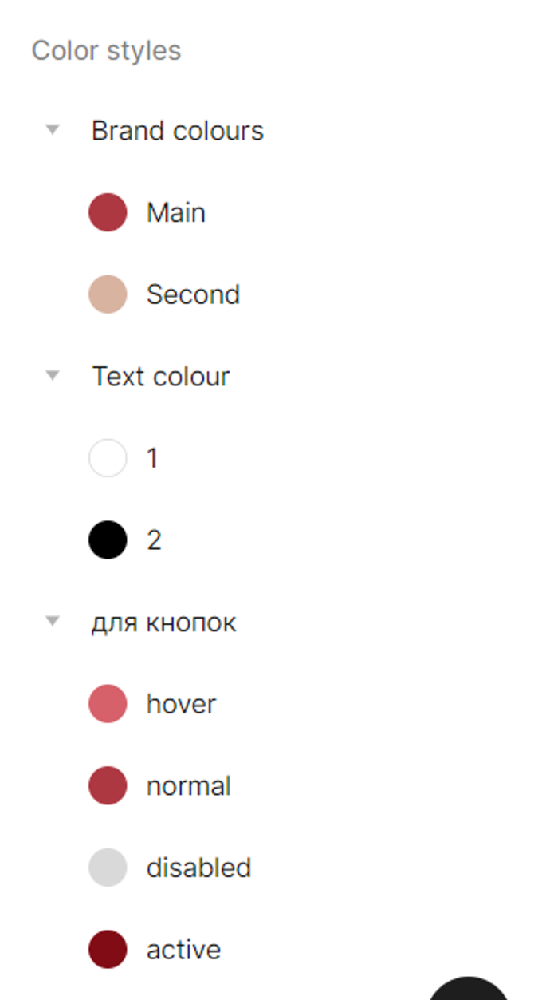

# Проект для сайта

## Цели
Цели сайта для заказа тортов и выпечки обычно связаны с удобством заказа и повышением продаж. Цели моего сайта:

1. Увеличение количества заказов. Сайт должен быть удобным и привлекательным для пользователей, чтобы они могли легко и быстро оформить заказ.
2. Повышение узнаваемости бренда. Сайт должен отображать уникальный стиль и фирменный знак, чтобы пользователи могли легко узнать бренд и запомнить его.
3. Увеличение среднего чека. Сайт может предлагать дополнительные услуги, такие как доставка или упаковка, которые могут увеличить средний чек.
4. Улучшение качества обслуживания. Сайт может предоставлять информацию о продуктах, отзывы клиентов и контактную информацию для связи с компанией.

Для достижения этих целей необходимо выполнить следующие задачи:

1. Разработать удобный и привлекательный дизайн сайта, который будет соответствовать бренду компании.
2. Разработать функциональность сайта, которая позволит пользователям легко и быстро оформлять заказы.
3. Разработать систему управления заказами, которая позволит компании эффективно обрабатывать заказы и своевременно доставлять продукты.
4. Предоставить информацию о продуктах, отзывы клиентов и контактную информацию для связи с компанией.
5. Разработать маркетинговую стратегию для привлечения новых клиентов и увеличения продаж.
6. Оптимизировать сайт для поисковых систем, чтобы он был легко найден потенциальными клиентами.
7. Проводить анализ эффективности сайта и вносить необходимые изменения для улучшения его работы и достижения поставленных целей.

## Контекст

### Целевая аудитория

Целевая аудитория сайта для заказа тортов и выпечки включает в себя людей разных возрастов и социальных групп, которые интересуются качественной и вкусной кондитерской выпечкой. Основная аудитория может быть представлена женщинами и молодыми семьями, которые заказывают торты и другие сладости на праздники и торжества.

Способы взаимодействия с ЦА:

- Онлайн-заказ тортов и других сладостей через сайт;
- Онлайн-консультации и поддержка клиентов через чат или телефон;
- Рассылка новостей и акций на электронную почту;
- Продвижение сайта в социальных сетях и блогах.

Потребности целевой аудитории сайта для заказа тортов и выпечки могут быть различными, но обычно они связаны с желанием получить качественную и вкусную выпечку, которая будет соответствовать их вкусам и предпочтениям. Кроме того, клиенты могут ожидать удобства и быстроты заказа, а также возможности получить консультацию и поддержку при выборе торта или другой выпечки.

### Конкуренты

1. https://www.maria-irk.ru/

На мой взгляд сайт довольно таки не плохо выполнен, он имеет яркий и привлекательный дизайн, удобную и продуманную навигацию. Недостатки по моему мнению тоже присутствуют, некоторые страницы загружаются достаточно медленно из-за количества изображений, также не все страницы удобно просматриваются в мобильной версии.

2. https://stefanycake.ru/

Приятный дизайн сайта, который соответствует тематике сайта и создает положительное впечатление у посетителей, удобная навигация в меню, но на мой взгляд слишком большая шапка у сайта. На главной странице очень мало информации, хотя мне кажется, что главная страница на то и имеет такое название, чтобы максимально развернуто рассказать о том, что имеется на сайте, естественно в сжатом виде, но какая-то информация должна присутствовать.
Нет адаптивного дизайна для мобильных устройств, что тоже довольно таки большой минус.

3. https://mycakehome.ru/

Лично для меня дизайн сайта выполнен очень красиво и привлекательно, но опять же в декстопной версии сайта, на мой взгляд, шапка слишком громоздкая, можно было сделать ее поменьше, так как она занимает довольно таки много места.

### Сторонний опыт

Функциональные решения:

- Форма заказа: Самое важное функциональное решение, которое нужно реализовать на сайте, это форма заказа. Форма должна включать поля для ввода имени, телефона, адреса доставки, даты и времени доставки, выбора оплаты(наличными, картой курьеру/онлайн, а также для выбора торта или другой выпечки из меню. Форма должна быть простой и интуитивно понятной, чтобы клиенты могли быстро и легко разместить заказ.
- Корзина: Другое важное функциональное решение, которое нужно реализовать на сайте, это корзина. Корзина должна отображать выбранные клиентом товары и их стоимость, а также позволять изменять количество товаров и удалять товары из корзины. Корзина должна быть доступна на всех страницах сайта, чтобы клиенты могли легко управлять своими заказами.
- Система отзывов: Добавление системы отзывов на сайт может помочь привлечь новых клиентов и улучшить репутацию вашего бизнеса. Система отзывов должна позволять клиентам оставлять отзывы о заказанной продукции и оценивать ее, а также позволять владельцу сайта отвечать на отзывы и решать возникающие проблемы.

Дизайнерские решения:

- Яркий и привлекательный дизайн привлекает внимание клиентов и создает положительное впечатление о компании.
- Качественные фотографии кондитерских изделий позволяют клиентам увидеть, как выглядит продукт в реальности, и сделать правильный выбор. Добавление фотографий тортов и другой выпечки может помочь привлечь внимание клиентов и показать им, как выглядят готовые изделия.
- Шрифты: Выбор шрифтов может помочь улучшить читабельность и привлекательность сайта. Шрифты должны быть легко читаемыми и соответствовать бренду.
- Цветовая схема: Выбор цветовой схемы может помочь создать уникальный и привлекательный дизайн сайта. Цвета должны соответствовать бренду и привлекать внимание клиентов.
- Удобный интерфейс позволяет клиентам легко и быстро оформить заказ и не отвлекаться на ненужные детали.
- Адаптивный дизайн: Важным дизайнерским решением является создание адаптивного дизайна, который будет корректно отображаться на всех устройствах, включая мобильные телефоны и планшеты. Адаптивный дизайн должен обеспечивать удобство использования сайта на всех устройствах и упрощать процесс оформления заказа.

#### Ограничения:

Закон о безопасности пищевых продуктов: Сайт должен соответствовать законодательным требованиям в отношении обработки и хранения данных о пищевых продуктах, а также в отношении безопасности и гигиены при их производстве и доставке.

2. Закон о защите персональных данных: Сайт должен соответствовать законодательным требованиям в отношении обработки персональных данных клиентов, включая их адреса, номера телефонов, адреса электронной почты и другие личные данные.

3. Ограничения на использование материалов: Сайт не должен нарушать авторские права и другие права собственности на материалы, которые используются на сайте, такие как фотографии, изображения, тексты и т.д.

4. Ограничения на использование платежных систем: Сайт должен соответствовать требованиям платежных систем, которые используются для обработки платежей, включая требования к безопасности и конфиденциальности.

5. Ограничения на использование рекламы: Сайт должен соответствовать законодательным требованиям в отношении использования рекламы, включая требования к ее размещению, содержанию и формату.

6. Ограничения на использование контента: Сайт не должен содержать контент, который может быть оскорбительным, дискриминирующим или нарушающим права других людей или групп.

### Влияние и тенденции

Факторы влияния:

1. Конкуренция: Конкуренция в этой отрасли может быть довольно жесткой, поэтому важно разработать сайт, который будет привлекать большее количество клиентов, чем у конкурентов.
2. Удобство использования: Сайт должен быть удобным и легким в использовании, чтобы клиенты могли быстро и легко заказывать торты и выпечку.
3. Доступность: Сайт должен быть доступен для клиентов 24 часа в сутки и 7 дней в неделю, чтобы они могли сделать заказ в любое время.
4. Информативность: Сайт должен содержать достаточно информации о продуктах, чтобы клиенты могли сделать информированный выбор.
5. Цены: Цены на продукты должны быть конкурентоспособными и привлекательными для клиентов.
6. Качество продуктов: Качество продуктов должно быть высоким и соответствовать ожиданиям клиентов.
7. Маркетинг: Маркетинговые кампании и реклама могут помочь привлечь больше клиентов на сайт.

Тенденции:

1. Рост популярности онлайн-заказов: С каждым годом все больше людей предпочитают заказывать торты и выпечку онлайн вместо покупки в магазине.
2. Рост популярности здоровых продуктов: В последние годы все больше людей становятся более здоровыми и обращают внимание на качество продуктов, которые они употребляют. Это может привести к увеличению спроса на здоровые торты и выпечку.
3. Рост популярности персонализированных продуктов: Большинство клиентов хотят, чтобы их продукты были уникальными и персонализированными.
4. Рост популярности доставки: С каждым годом все больше людей предпочитают заказывать продукты с доставкой, поэтому важно иметь возможность доставлять продукты клиентам.

## Концепция

Сайт для заказа тортов и выпечки позволяет пользователям выбирать и заказывать продукты онлайн. На сайте представлена информация о продуктах, ценах и способах оплаты и доставки. Пользователи могут выбрать продукты, которые им нравятся, добавить их в корзину и оформить заказ. Заказы обрабатываются администраторами сайта и затем доставляются клиентам.

Сайт для заказа тортов и выпечки может монетизироваться различными способами. Например:

- Продажа продуктов: Сайт может получать прибыль от продажи тортов и выпечки.
- Реклама: Сайт может получать доход от размещения рекламы на своих страницах.
- Оплата за рекламу в поисковых системах: Сайт может получать доход от оплаты рекламных кампаний в поисковых системах.

Отличительные особенности:

- Удобный интерфейс и легкий поиск продуктов.
- Большой выбор тортов и выпечки.
- Высокое качество продуктов.
- Быстрая и надежная доставка.
- Высокий уровень безопасности и конфиденциальности.

Рекомендации к развитию и поддержке сайта после его запуска:

- Улучшение пользовательского интерфейса и удобства использования сайта.
- Расширение ассортимента продуктов и улучшение качества продукции.
- Развитие программ лояльности и акций для клиентов.
- Разработка мобильного приложения для удобства заказов через мобильные устройства.

## Функциональные возможности

Функциональные возможности, которые могут быть интересны пользователям:

1. Регистрация и авторизация: для того чтобы пользователи могли сохранять свои данные, просматривать историю заказов и получать персонализированные рекомендации, сайт должен предоставлять возможность регистрации и авторизации. При регистрации пользователь должен ввести свои контактные данные, такие как имя, фамилию, адрес электронной почты и телефон, а также выбрать логин и пароль.
2. Корзина: пользователи должны иметь возможность добавлять продукты в корзину и просматривать ее содержимое. Корзина должна отображать общую стоимость заказа, а также предоставлять возможность изменять количество продуктов и удалять продукты из корзины.
3. Оформление заказа: пользователи должны иметь возможность оформить заказ, введя необходимые данные, такие как адрес доставки, способ оплаты и прочее. Сайт должен предоставлять удобную форму для ввода данных и отображать общую стоимость заказа.
4. Отслеживание статуса заказа: пользователи должны иметь возможность отслеживать статус своего заказа, например, узнать, когда заказ был принят, когда он был готов к доставке и когда он был доставлен. Сайт должен предоставлять удобный интерфейс для отслеживания статуса заказа.
5. Обратная связь: пользователи должны иметь возможность оставлять отзывы о продуктах и о качестве обслуживания. Сайт должен предоставлять удобную форму для оставления отзывов и отображать их на странице продукта.

Пример сценария использования:

1. Пользователь заходит на сайт и регистрируется, вводя свои контактные данные.
2. Пользователь добавляет торт или выпечку в корзину.
3. Пользователь оформляет заказ, вводя данные для доставки и выбирая способ оплаты.
4. Пользователь получает подтверждение о принятии заказа и отслеживает его статус на сайте.
5. Пользователь получает заказ и оставляет отзыв о продукте.

## Функциональные возможности

Для текста логотипа и некоторых заголовков использовался шрифт Mak Bold

Для всех остальных заголовков и текста использовался шрифт Montserrat в разных начертаниях

## Структура

- Главная страница
- Торты
    - Торты
    - Тортовые полосы
    - Торты на заказ
    - Начинки
    - Декор
- Выпечка
    - Булочные изделия
    - Пироги
    - Пирожные
- О нас
    - О компании
    - Доставка
    - Оплата
    - Контакты